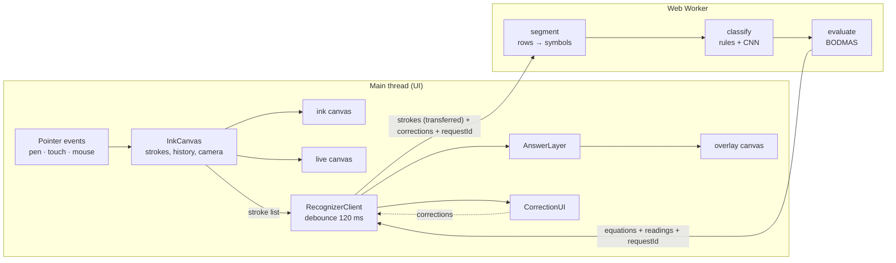

# CalcInk — Architecture & Design

This document explains how CalcInk turns pen strokes into answers: the system architecture,
the stroke-to-tensor pipeline, why the recognition approach was chosen over the alternatives,
the mathematics behind the evaluator, and how performance, offline operation and accuracy were
engineered and measured.

**Contents**

1. [Requirements → design decisions](#1-requirements--design-decisions)
2. [System architecture](#2-system-architecture)
3. [From pen to tensor: the recognition pipeline](#3-from-pen-to-tensor-the-recognition-pipeline)
4. [Recognition model: choice and alternatives](#4-recognition-model-choice-and-alternatives)
5. [The arithmetic engine (BODMAS)](#5-the-arithmetic-engine-bodmas)
6. [When recognition is wrong: confidence, repair, correction](#6-when-recognition-is-wrong-confidence-repair-correction)
7. [Performance: keeping 60 FPS](#7-performance-keeping-60-fps)
8. [100 % on-device and offline](#8-100--on-device-and-offline)
9. [Canvas, high-DPI and the zoomable page](#9-canvas-high-dpi-and-the-zoomable-page)
10. [Evaluation methodology and results](#10-evaluation-methodology-and-results)
11. [Limitations and future work](#11-limitations-and-future-work)

---

## 1. Requirements → design decisions

| Requirement (problem statement)                                  | Design decision                                                                                                | Where                  |
| ---------------------------------------------------------------- | -------------------------------------------------------------------------------------------------------------- | ---------------------- |
| Fluid ink, mouse/stylus/touch, undo/redo, erasers, DPI scaling   | Pointer Events, vector strokes, three canvas layers, snapshot history, `devicePixelRatio`-sized backing stores | `src/ink/`             |
| Recognise `0–9 + − × ÷ . =` with a pre-trained open-source model | Hybrid: MNIST CNN (ONNX) for digits, geometric rules for operators                                             | `src/recognition/`     |
| BODMAS, multi-digit, decimals, negatives                         | Tokenizer + recursive-descent parser over a precedence grammar                                                 | `src/math/evaluate.ts` |
| Answer projected next to `=`, re-evaluated on edit               | Whole-page re-recognition on every change; answers keyed by the `=` strokes                                    | `src/ui/answers.ts`    |
| 100 % client-side, works in airplane mode                        | No network calls after load; Service Worker precaches model, WASM runtime, fonts                               | `vite.config.ts`       |
| 60 FPS during recognition                                        | All recognition in a Web Worker; drawing batched per animation frame                                           | `src/worker/`          |
| No `eval()`, graceful errors                                     | Parser returns typed results (`ok` / `undefined` / `error` + reason); never throws                             | `src/math/evaluate.ts` |

---

## 2. System architecture

The app is a static site with **two threads** in the browser. The main thread owns everything
the user sees and touches; the worker owns everything expensive.



**Main thread** — `src/ink`, `src/ui`, `src/main.ts`

- `InkCanvas` turns pointer events into immutable `Stroke` objects, draws them, and owns the
  undo history and the pan/zoom camera.
- `AnswerLayer` draws answers; `CorrectionUI` is tap-to-correct; plus toolbar, panel, feedback.

**Worker** — `src/worker`, `src/recognition`, `src/math`

- Loads the ONNX model once, then answers "recognise this page" requests.

**Why two threads.** A browser tab has a single UI thread that also paints the screen. Running
segmentation and CNN inference there would stall the pen after every stroke. The worker has no
DOM and shares no memory with the UI — it receives a copy of the strokes and replies with
results, so neither side ever waits for the other.

**Messages** (`src/worker/protocol.ts`)

| Direction   | Message     | Contents                                                                                    |
| ----------- | ----------- | ------------------------------------------------------------------------------------------- |
| UI → worker | `recognize` | `requestId`, strokes as flat `Float32Array`s (transferred, not copied), user corrections    |
| worker → UI | `ready`     | model load time                                                                             |
| worker → UI | `result`    | `requestId`, equations (expression, answer, symbols, confidence, anchor), per-line readings |

**Consistency without locks.** Every request carries an increasing `requestId`. The worker only
processes the newest pending request ("latest request wins"), and the UI discards any result
whose id is not the latest — so an answer for strokes that no longer exist is never shown.

### Life of one stroke

1. **Pen down** — the point is converted from screen to page ("world") coordinates.
2. **Pen moves** — coalesced events recover the stylus's full sample rate; points closer than
   0.75 px (at the current zoom) are skipped; the live canvas redraws once per animation frame.
3. **Pen up** — the stroke is frozen, appended to the ink canvas, pushed to history, autosaved.
4. **120 ms later** (restarted by further strokes, so half a `+` is never recognised), the page
   is sent to the worker.
5. **Worker** — segment → classify → evaluate (≈ 2 ms for one equation, ≈ 40 ms for a full page).
6. **Result** — answers whose value changed animate in; unchanged ones stay still.

---

## 3. From pen to tensor: the recognition pipeline

```
strokes ─► ① features ─► ② rows ─► ③ symbols ─► ④ classify ─► ⑤ expression ─► ⑥ evaluate
                                                  ├─ operators: geometric rules
                                                  └─ digits: rasterise 28×28 → CNN → softmax
```

Everything operates on **vector strokes in world coordinates** — never on screen pixels — so the
result is independent of zoom, pan and device pixel ratio.

### ① Stroke features (`shapes.ts: strokeFeatures`)

For each stroke: bounding box (`w`, `h`), centre, chord angle, and **straightness**

$$\text{straightness} = \min\left(\frac{\text{chord}}{\text{path length}},\; 1 - \frac{\text{max deviation from chord}}{2\cdot\text{chord}}\right)$$

1 for a perfect line, lower for curves. Real pens add small hooks where the nib lands and
lifts, so shape features are measured on the stroke with the first and last 12 % of its path
length trimmed (`trimHooks`). On real tablet ink this raised a clearly straight `=` bar from
0.58 to ≈ 0.97.

### ② Rows (`segment.ts`)

1. The **unit of scale** is the line height: the median height of upright strokes carrying a
   real amount of ink (≥ 30 % of the line's longest stroke). All size thresholds below are
   fractions of it, so recognition works at any writing size and zoom.
2. **Tall strokes are linked into rows** (union-find) when they overlap vertically, their
   vertical **centres** are within half a glyph height, and the horizontal gap is at most
   3.5 glyph heights. Linking by centres keeps a tall bracket in its row while a scribble that
   spans two rows (centre between them) cannot merge them.
3. **Small strokes** (dots, minus bars) attach to the row band that contains them.
4. A row is split where a horizontal gap exceeds 3.5 line heights (two equations side by side).

### ③ Symbols

Strokes, sorted left to right, are merged into one symbol when any of these holds:

| Rule                                                                       | Example                                           |
| -------------------------------------------------------------------------- | ------------------------------------------------- |
| ≥ 50 % horizontal overlap **and** written within 2 strokes of each other   | the two bars of `=`                               |
| The strokes **cross**, whenever drawn, if together ≤ 1.2 line heights wide | a `+` finished after erasing something            |
| Drawn consecutively and **touching**, together ≤ 0.8 wide and ≤ 1.3 tall   | an open `4` whose stem meets the first stroke     |
| Small marks above/below a single bar, in any order                         | `÷` whose dots were added last or tapped twice    |
| A short bar in the top third of a digit it overlaps                        | the cap of a `5` added after the rest of the line |
| Two tiny taps a hair apart                                                 | a double-tapped decimal point                     |

### ④a Operators: geometric rules (`shapes.ts: classifyOperator`)

| Symbol  | Rule (sizes relative to line height _H_)                                                                                                                                          |
| ------- | --------------------------------------------------------------------------------------------------------------------------------------------------------------------------------- |
| `.`     | one stroke, size ≤ 0.3 _H_ (and not above the digits — stray touches there are ignored)                                                                                           |
| `−`     | one horizontal bar ≥ 0.3 _H_ long; also two flat strokes on top of each other (retraced)                                                                                          |
| `=`     | two horizontal bars, not crossing, vertically separated                                                                                                                           |
| `+`     | a horizontal and a vertical bar that cross or nearly cross; if they truly cross, a tilted or hooked bar is accepted as long as it stays thin                                      |
| `×`     | two diagonal bars with opposite slopes that cross (one leg may be steep or slightly curved)                                                                                       |
| `÷`     | exactly one bar plus small marks both above and below it                                                                                                                          |
| `(` `)` | one tall stroke that is a **smooth arc** (straightness ≥ 0.65), bows 0.13–0.6 of its length to one side, with its widest point in the middle 70 %; bowing left → `(`, right → `)` |
| `1`     | one straight, near-vertical stroke taller than half a line                                                                                                                        |

Each threshold was set from measurements of real tablet strokes (see §10). For example, on
29 real brackets the bow was 0.16–0.43 and straightness ≥ 0.71, while real `1`s bowed ≤ 0.11 —
the bracket rule sits in that gap.

### ④b Digits: strokes → 28 × 28 tensor → CNN (`rasterize.ts`, `model.ts`)

The model expects MNIST-style images, so the strokes of one symbol are rendered exactly the way
the MNIST training set was prepared:

1. **Size-normalise:** scale the symbol's bounding box so its longer side is 20 px, preserving
   aspect ratio (a `1` stays thin), inside a 28 × 28 frame.
2. **Rasterise analytically:** each pixel's intensity comes from its distance _d_ to the nearest
   stroke segment, `clamp(r + 0.5 − d, 0, 1)` with pen radius _r_ = 1.15 px — an anti-aliased
   stroke about 2–3 px wide, like MNIST. No canvas is involved, so the result is identical in the
   worker, in Node tests and at any screen DPI.
3. **Centre by centre of mass:** shift the image so its intensity-weighted centre is at (14, 14),
   as MNIST does.
4. **Tensor:** `float32 [1, 1, 28, 28]`, white ink on black, values in [0, 1].

The CNN returns 10 raw scores (logits) _z_. **Softmax** turns them into probabilities:

$$p_i = \frac{e^{z_i - \max z}}{\sum_j e^{z_j - \max z}}$$

(subtracting the maximum keeps it numerically stable). The top class is the digit and _p_ is
its confidence; the next three are kept as suggestions for tap-to-correct.

**The network** (verified from the model file): Conv 5×5, 8 filters, same padding → ReLU →
MaxPool 2×2 (28→14) → Conv 5×5, 16 filters → ReLU → MaxPool 3×3 (14→4) → flatten (16·4·4 = 256)
→ fully connected → 10 logits. 5,994 learned parameters; 26 KB.

All digit symbols of a page go to the model in one batched call — including lines without `=`,
so the panel can show what every line reads (the pipeline can also skip those lines, as the
tests do).

### ⑤ Expression

Symbols are joined left to right. Each `=` ends an equation (the expression runs from the
previous `=` or the line start). An `=` only gets an answer if nothing follows it within one
line height — so `2 + 2 = 4` written by the user is left alone. The answer is anchored to the
right edge of the `=` and the line's vertical centre.

---

## 4. Recognition model: choice and alternatives

The problem statement asks for an existing pre-trained model and puts the emphasis on software
craft, performance and UX. These options were considered:

| Option                                                                                 | What it is                                     | Size                             | Speed                                 | Fit with the constraints                                                                                       |
| -------------------------------------------------------------------------------------- | ---------------------------------------------- | -------------------------------- | ------------------------------------- | -------------------------------------------------------------------------------------------------------------- |
| **A. MNIST CNN + geometric rules** (chosen)                                            | Tiny digit CNN; operators from stroke geometry | 26 KB model + 14 MB WASM runtime | < 1 ms per symbol                     | Offline ✓, 60 FPS ✓, fully explainable ✓. Rules must be measured against real handwriting.                     |
| B. Math-symbol CNN (e.g. trained on HASYv2 or the Kaggle handwritten math symbols set) | One classifier for digits and operators        | typically 0.1–5 MB               | ≈ 1 ms per symbol                     | Still needs the same stroke grouping; needs a trustworthy pre-trained model with a clear licence               |
| C. Full-expression model (encoder–decoder, e.g. trained on CROHME)                     | Image of the whole expression → LaTeX/text     | typically tens to hundreds of MB | hundreds of ms or more per expression | No grouping code, but a large download and slow inference on a tablet risk the offline and 60 FPS requirements |
| D. Template matching ($P-family recognisers)                                           | Compares strokes to stored examples            | KB                               | very fast                             | Not a pre-trained ML model; needs a template set                                                               |
| E. Commercial / cloud handwriting SDKs                                                 | Vendor recognisers                             | —                                | —                                     | Not allowed (cloud) or not available in the browser                                                            |

**Why A.**

1. **The operators are geometry.** `+ − × ÷ = . ( )` are made of straight bars, dots and one
   arc; their stroke count, orientation and layout identify them. On the vector strokes this is
   more reliable than any pixel classifier — and the rules can use information a 28 × 28 image
   loses (stroke order, which strokes cross, pen hooks).
2. **Constraints.** A 26 KB model loads instantly, runs in well under a millisecond, and keeps
   the offline bundle small; C would put both the offline and the 60 FPS requirements at risk.
3. **Grouping is needed anyway.** Every option except C still has to split the page into
   symbols — most real-world errors we found were in that step, not in classification.
4. **Evidence.** On unseen real handwriting (test sheet 2) the result is 99 % of symbols and
   100 % of digits (§10). The remaining model errors are handled by tap-to-correct.

Option B remains the natural upgrade: it would make operator recognition model-driven as well,
with the rules kept as a cross-check. The benchmark in §10 is the tool to decide it on data.

---

## 5. The arithmetic engine (BODMAS)

`src/math/evaluate.ts` never calls `eval()`. The expression is tokenised and parsed by a
**recursive-descent parser** for this grammar:

```
expr    := term    (('+' | '−') term)*        lowest precedence
term    := unary   (('×' | '÷') unary)*
unary   := ('−' | '+') unary | primary
primary := NUMBER | '(' expr ')'              highest precedence
```

**Why this guarantees BODMAS.** An `expr` can only add or subtract complete `term`s, and a `term`
is fully evaluated — every `×` and `÷` inside it — before it is returned to `expr`. So a
multiplication can never be split by an addition. Brackets sit in `primary`, the innermost rule,
and restart the grammar at `expr`, so they are evaluated first. Precedence comes from the
structure of the grammar, not from special cases.

**Left associativity.** The `( … )*` loops apply operators left to right:
`10 − 4 − 3 = (10 − 4) − 3 = 3` and `100 ÷ 10 ÷ 2 = 5`.

**Worked example** — `27 − ((18 + 7) ÷ 5 − 27)`:

```
expr: 27 − term
           └ primary ( expr )
                      expr: term − 27
                            └ term: primary ÷ 5
                                    └ ( expr: 18 + 7 = 25 )
                              25 ÷ 5 = 5
                      5 − 27 = −22
      27 − (−22) = 49
```

**Details**

- **Numbers:** multi-digit and decimal (`7.25`, `.5`); a number with two decimal points is an error.
- **Negatives:** unary minus anywhere a number may start (`−8 + 20`, `4 × −2`, `−(2 + 3)`).
- **Implicit multiplication:** a `×` is inserted between adjacent values around brackets —
  `2(3 + 4)`, `(1 + 2)(3 + 4)`, `(2 + 3)4`.
- **Division by zero** is checked before dividing → **Undefined**. Non-finite results (overflow)
  are also Undefined.
- **Errors never throw** out of `evaluate()`. Each syntax problem has a code and a short reason
  that is drawn on the paper: `missing )`, `extra )`, `empty ( )`, `two operators`,
  `nothing after +`, `starts with ×`, `bad number 1.2.3`.
- **Floating point:** results are rounded to 12 significant digits, so `0.1 + 0.2` shows `0.3`;
  `−0` shows `0`; very large or small magnitudes use exponent form; negatives use a typographic `−`.

---

## 6. When recognition is wrong: confidence, repair, correction

No recogniser is perfect, so the app makes errors **visible** and **cheap to fix**.

- **Confidence.** An equation's confidence is its weakest symbol's (softmax probability for
  digits, a fixed rule confidence for operators). Below 0.6 the answer gets a dashed amber
  underline.
- **Bracket-balance repair.** If an expression fails _and_ its brackets don't balance, the
  likeliest misread is a `(`/`)` read as `1` or vice versa. Candidates are only strokes near the
  bracket/`1` boundary (by their measured bow), a `1` may only become the bracket it bends
  towards, and the most plausible single swap — or pair of swaps — that makes the expression
  balanced **and** valid wins. Repaired symbols are marked as guesses (confidence 0.5 → amber),
  so a repair is never silent, and a user correction is never overridden.
- **Tap-to-correct.** Tapping an answer shows what was read under each symbol; tapping a symbol
  offers the model's runner-up digits first, every symbol, and "ignore this mark". Corrections
  are keyed by the symbol's **stroke ids**, sent with each request and applied inside the
  pipeline — so the answer, confidence and panel all update, and a correction disappears by
  itself when its strokes are erased or rewritten.
- **"What CalcInk reads" panel** lists every line, including unsolved ones with the reason
  (e.g. "No = found").

---

## 7. Performance: keeping 60 FPS

| Technique                                                 | Effect                                                                                         |
| --------------------------------------------------------- | ---------------------------------------------------------------------------------------------- |
| Recognition in a **Web Worker**                           | Segmentation, rasterisation, inference and parsing never block input or painting               |
| Drawing batched in `requestAnimationFrame`                | Input handlers only record points; at most one redraw per frame                                |
| **Three canvas layers**: ink, live stroke, answers        | The stroke being drawn redraws alone; a finished stroke is appended without redrawing the page |
| Coalesced pointer events                                  | Full stylus sample rate without extra event handling                                           |
| 120 ms debounce + latest-request-wins                     | A burst of strokes costs one extra recognition, not one per stroke                             |
| Stroke buffers **transferred**, not copied, to the worker | No copy cost on the UI thread                                                                  |
| Off-screen strokes culled when redrawing                  | Large pages stay cheap to pan and zoom                                                         |
| Answer redraws coalesced per frame                        | Fast trackpad zooming doesn't redraw answers several times per frame                           |

**Measured** (recognition pipeline with the real model, in Node on the development laptop):
≈ 2.4 ms for a 12-stroke equation and ≈ 38 ms for a 447-stroke page with 25 lines. This runs in
the worker, so even the large page doesn't cost the UI thread a frame.

**Memory.** Strokes are immutable, so an undo snapshot is just an array of references; history
is capped at 200 states. ONNX input/output tensors are disposed after every inference; answer
animations stop their frame loop once finished.

---

## 8. 100 % on-device and offline

- After the page loads, the app makes **no network requests**: the model, the ONNX Runtime
  WebAssembly binary and the fonts are served from the app's own origin.
- A **Service Worker** (vite-plugin-pwa / Workbox) precaches every asset on the first visit —
  14 files, about 14.3 MB, of which 14.2 MB is the WASM runtime (≈ 3.7 MB compressed). Later
  visits load entirely from the cache, so the app works in airplane mode.
- Verified on the production build: with the server shut down, a reload still loaded the app,
  the model initialised from the cache, and `6 × 7 =` was solved; no request went to any
  other host.
- Autosave (page, zoom, corrections) uses `localStorage` on the device, with every access guarded
  so private browsing still works.

---

## 9. Canvas, high-DPI and the zoomable page

- **High-DPI:** each canvas's backing store is `round(cssSize × devicePixelRatio)` and drawing is
  scaled by the ratio, so strokes stay crisp at 1×, 1.25×, 1.75× (the test tablet), 2× and 3×.
  DPR changes (moving between monitors, browser zoom) are detected and trigger a resize.
- **Camera:** strokes are stored in world coordinates; `screen = world × scale + offset`. Zoom
  keeps the point under the cursor or fingers fixed. The ruled paper is a CSS background driven
  by the same camera through CSS variables, so paper, ink and answers are updated before the
  same paint and can never drift apart.
- **Input model:** the pen writes; a finger pans (after a pen has been seen) and two fingers
  pan and pinch-zoom; mouse wheel scrolls, Ctrl + wheel zooms. Palm rejection ignores touches
  while the pen is down, for 0.6 s after it lifts, and any contact larger than a fingertip —
  and when the pen lands, an accidental palm pan is rolled back.
- **Smoothing:** strokes are drawn as quadratic Bézier segments through the midpoints of
  consecutive samples, with per-segment width from pen pressure.

---

## 10. Evaluation methodology and results

Recognition was developed **against real handwriting**, not only synthetic strokes:

1. A developer-only endpoint (present in `npm run dev` only) saves the tablet's raw strokes to
   the laptop.
2. **Test sheets** with known content are written on a real Android tablet with a stylus. A
   scorer aligns recognised lines to expected rows and symbols (dynamic-programming edit
   distance at both levels) and reports per-symbol accuracy, confusions and answer correctness
   (`npm run bench`).
3. Every failure is traced to its stage (grouping, operator rule, or model), fixed from
   measurements, and the page is added as a **regression test**.
4. A **second, fresh test sheet** — never used for tuning — measures generalisation.

| Stage             | Sheet 1          | Sheet 2 (unseen) |
| ----------------- | ---------------- | ---------------- |
| First measurement | 167 / 175 (95 %) | 147 / 153 (96 %) |
| After fixes       | 173 / 175 (99 %) | 152 / 153 (99 %) |
| Digits only       | 100 %            | 100 %            |

Fixes driven by the data included trimming pen hooks, line-height-relative size thresholds,
grouping strokes that cross or touch, retraced strokes, tilted brackets and a robust
line-height estimate. Several regressions were caught **only** because earlier real pages were
tests — for example, loosening the bracket rule briefly turned a real `5` into `)`, which led to
the smooth-arc requirement.

The test suite (176 tests) runs the parser, geometry, ink, recognition rules, the real ONNX model
on six real tablet recordings, and the benchmark, which fails if either sheet drops below 98 %.

---

## 11. Limitations and future work

- **Slanted lines.** Rows tilted more than ≈ 10° are not grouped reliably (measured: 100 % up to
  10°, failing from 15°). Planned: group strokes by writing time and proximity, fit a slope per
  row by least squares, rotate each row upright before recognition, and rotate the answer
  position back.
- **Model upgrade.** Evaluate a pre-trained math-symbol classifier (option B) on the same
  benchmark and adopt it where it measurably beats the rules.
- **Vocabulary.** Vertical fractions, exponents, roots and variables (e.g. `x = 10`) are not
  supported.
- **One-stroke cursive `×`** and unusual digit shapes rely on tap-to-correct.
